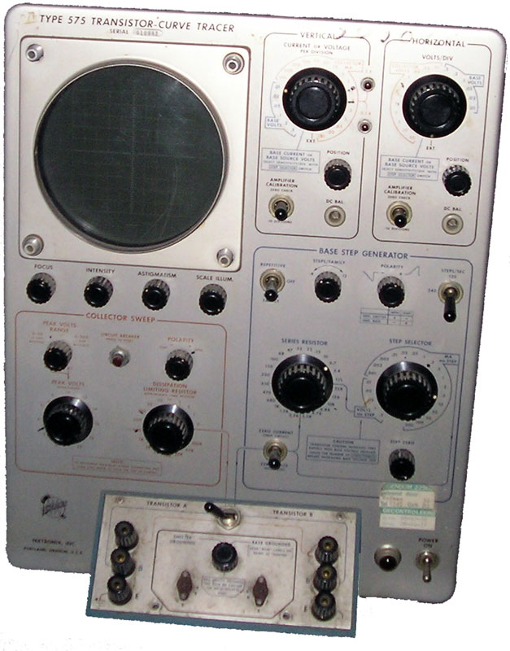
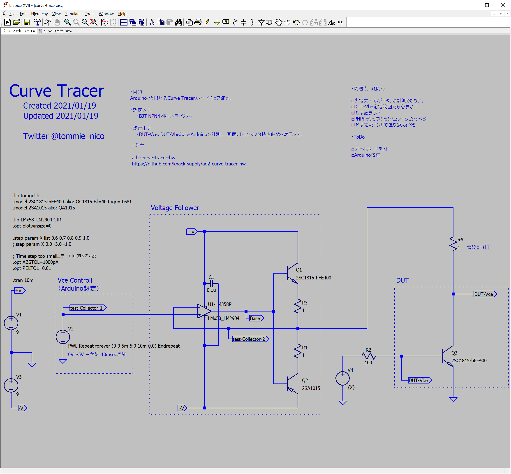
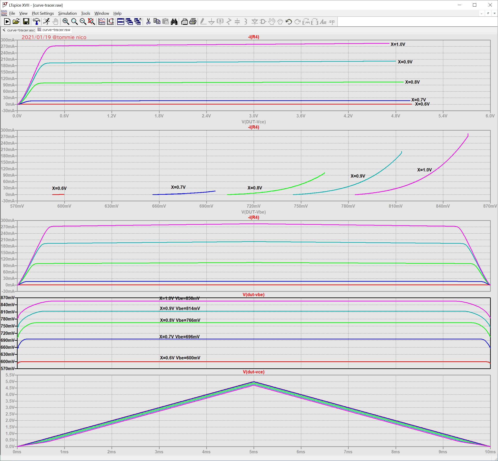

# Curve-Tracer

## Sammary (概要)

カーブトレーサー回路をLTspiceでシミュレーションした。
入手性の良い部品で構成した。

Arduinoで制御、表示する想定。

## カーブトレーサーとは

[半導体カーブトレーサー](https://ja.wikipedia.org/wiki/%E5%8D%8A%E5%B0%8E%E4%BD%93%E3%82%AB%E3%83%BC%E3%83%96%E3%83%88%E3%83%AC%E3%83%BC%E3%82%B5%E3%83%BC)

半導体カーブトレーサーは、ダイオード、トランジスタ、サイリスタなどの半導体素子の特性を測定するための機器。オシロスコープをベースに、電圧源、電流源を備えて被測定物（DUT）への印加をする。

## Status (状態)

LTspiceシミュレーション済み。
ブレッドボードで実装テストはまだしていない。

## Schematic (回路図)

## Simulation Result (シミュレーション結果)

画像の上から
・Vce-Ic曲線
・Vbe-Ic曲線

これらの特性曲線をArduinoでLCDディスプレイに表示する想定。

## ファイル構成

| # | File Name | Description|
----|----|----|
|1|curve-tracer.asc| カーブトレーサー回路図(LTspice用)|
|2|curve-tracer.plt| シミュレーション結果表示設定(LTspice用)|
|3|toragi.lib| 2SC1815のモデルライブラリ。書籍「トランジスタ技術」に付属していたもの。シミュレーションに必要。(LTspice用)|
|4|LMx58_LM2904.CIR|LM358Pのモデルライブラリ。シミュレーションに必要(LTspice用)|

## To be improved (改善すべき点)

・あまり精度が良くないかも。（プロトタイプとしては十分と思われるが）

## ToDo

・ブレッドボードでテスト
・FETを用いて大電流に対応する

## 参考にしたもの

[Analog Discovery 2™ Curve Tracer](https://knack.supply/product/ad2ct/)

・回路図
[ad2-curve-tracer-hw](https://github.com/knack-supply/ad2-curve-tracer-hw)